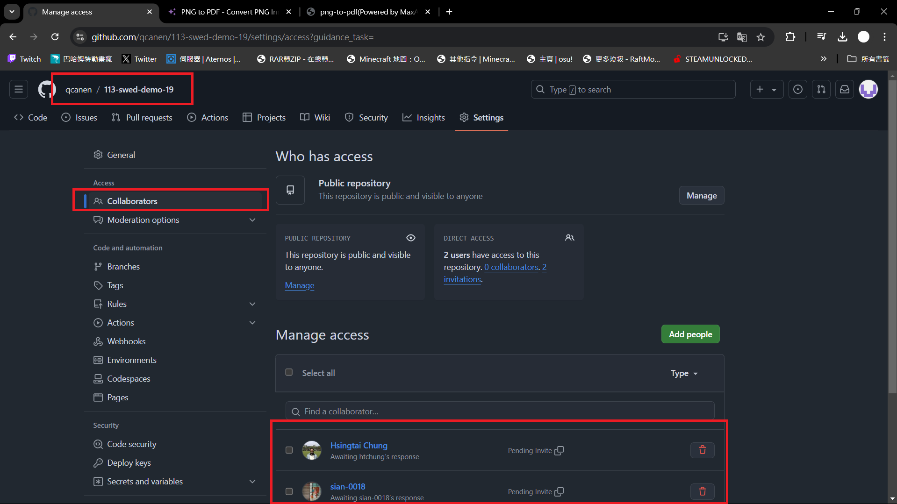
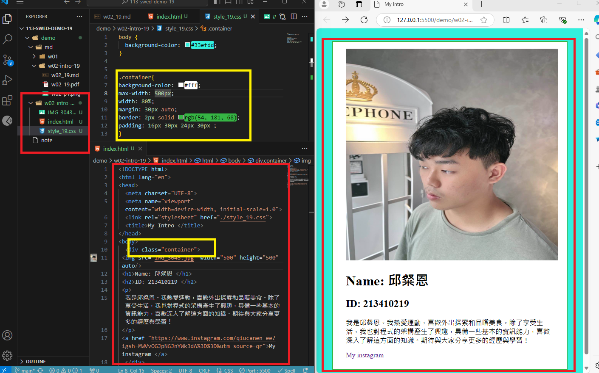

### w02-P1:Collaborate your Github repo to htchung@gms.tku.edu.tw and sian-0018  (TA)



```
5a8f063 qcanen  Fri Sep 27 13:59:22 2024 +0800  w02-P1:Collaborate your Github repo to htchung@gms.tku.edu.tw and sian-0018  (TA)
```

### w02-p2: My Introduction using  with css selector (container)





```
46dad19 qcanen  Fri Sep 27 15:35:38 2024 +0800   w02-p2: My Introduction using  with css selector (container)
```

### w02-p3: git logs of w2 

```
46dad19 qcanen  Fri Sep 27 15:35:38 2024 +0800   w02-p2: My Introduction using  with css selector (container)
a1aa21b qcanen  Fri Sep 27 14:21:51 2024 +0800  w02-P1:Collaborate your Github repo to htchung@gms.tku.edu.tw and sian-0018  (TA)
```