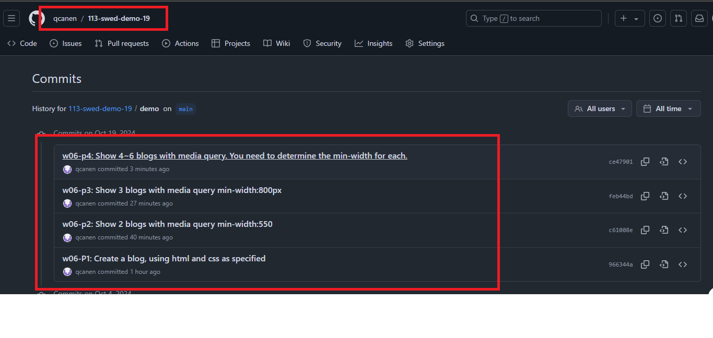

[Github URL](https://github.com/qcanen/113-swed-demo-19)


### w06-P1:  Create a blog, using html and css as specified


```
966344a qcanen  Sat Oct 19 00:54:36 2024 +0800  w06-P1:  Create a blog, using html and css as specified
```

### w06-p2: Show 2 blogs with media query min-width:550px


```
c61008e qcanen  Sat Oct 19 01:22:28 2024 +0800  w06-p2: Show 2 blogs with media query min-width:550
```


### w06-p3: Show 3 blogs with media query min-width:800px


```
feb44bd qcanen  Sat Oct 19 01:36:12 2024 +0800  w06-p3: Show 3 blogs with media query min-width:800px
```

### w06-p4: Show 4~6 blogs with media query. You need to determine the min-width for each.

#### => 4 blogs in a row


#### => 5 blogs in a row


#### => 6 blogs in a row


```
ce47901 qcanen  Sat Oct 19 01:59:36 2024 +0800  w06-p4: Show 4~6 blogs with media query. You need to determine the min-width for each.
```

### w06-p5:git logs of W6

 


