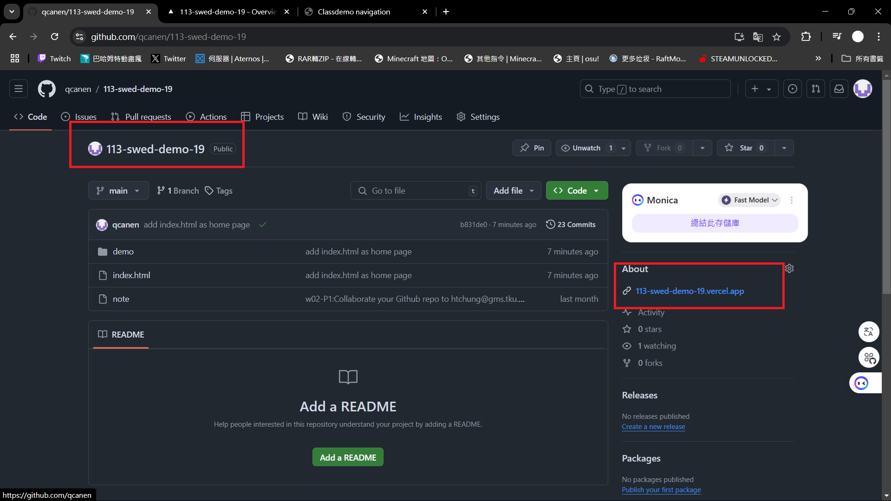
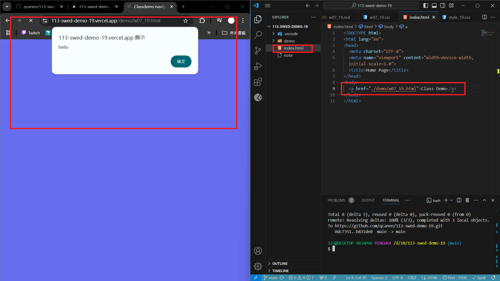
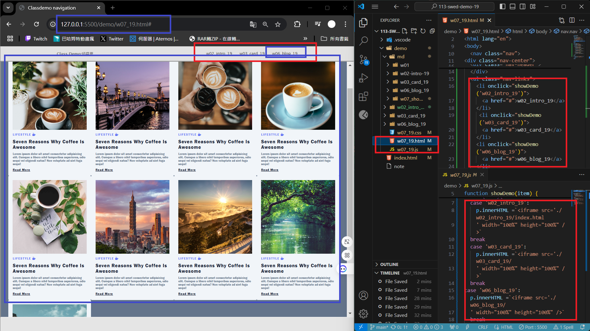
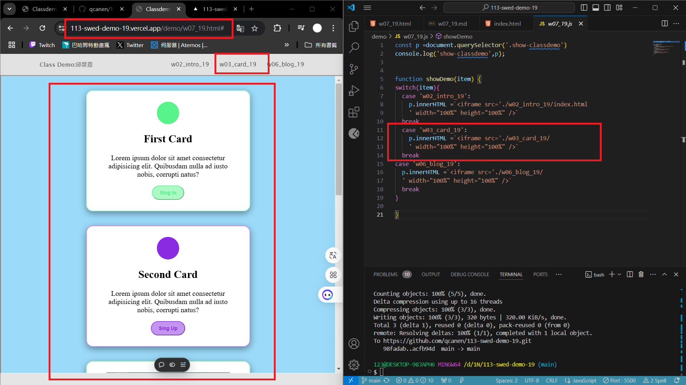
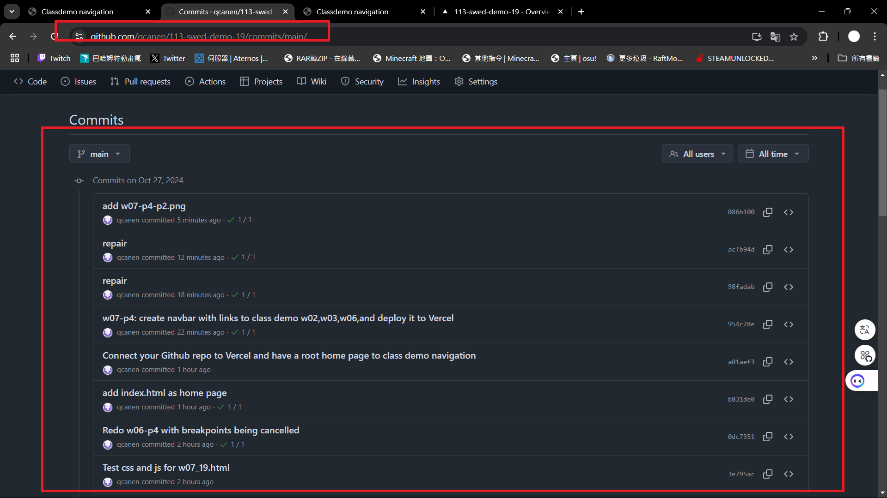

[Github URL](https://github.com/qcanen/113-swed-demo-19)

[My Vercle URL](https://113-swed-demo-19.vercel.app/)

### w07-P1:  Test css and js for w07_19.html


```
3e795ac qcanen  Sun Oct 27 19:17:43 2024 +0800  Test css and js for w07_19.html
```

### w07-p2: Redo w06-p4 with  breakpoints being cancelled 


```
0dc7351 qcanen  Sun Oct 27 19:32:23 2024 +0800  Redo w06-p4 with  breakpoints being cancelled
```


### w07-p3: Connect your Github repo to Vercel and have a root home page to class demo navigation

#### => In Vercel, show w06 blogs demo

#### => Show your Github repo with Vercel URL
[My Vercle URL](https://113-swed-demo-19.vercel.app/)



#### => create index.html as root home page and have a link to class demo navigation as demo in w07



```
a01aef3 qcanen  Sun Oct 27 20:20:44 2024 +0800  Connect your Github repo to Vercel and have a root home page to class demo navigation
```

### w07-p4: create navbar with links to class demo w02,w03,w06,and deploy it to Vercel

#### => local



#### => Verrcel



#### => 


```
954c28e qcanen  Sun Oct 27 21:23:51 2024 +0800  w07-p4: create navbar with links to class demo w02,w03,w06,and deploy it to Vercel
```

### w07-p5:git logs of W7

 

