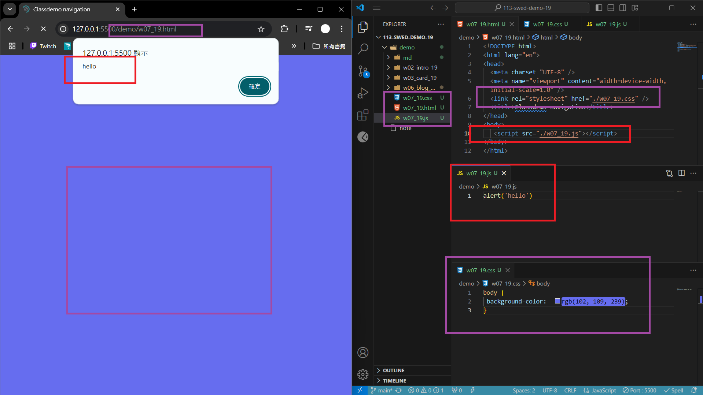
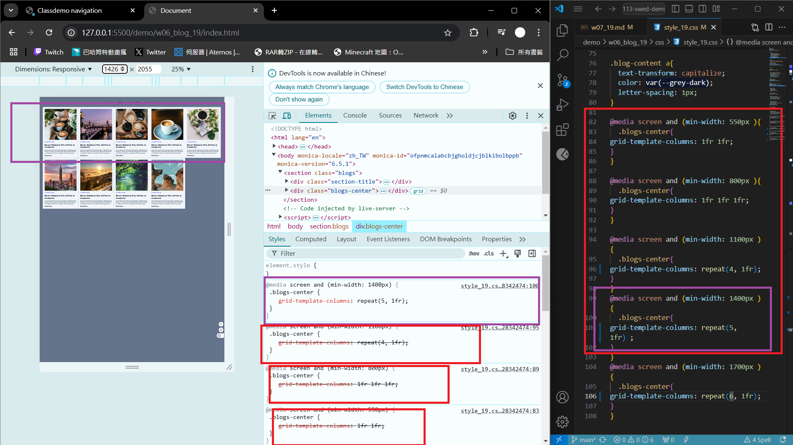

[Github URL](https://github.com/qcanen/113-swed-demo-19)


### w07-P1:  Test css and js for w07_19.html



```
3e795ac qcanen  Sun Oct 27 19:17:43 2024 +0800  Test css and js for w07_19.html
```

### w07-p2: Redo w06-p4 with  breakpoints being cancelled 





```

```


### w06-p3: 


```

```

### w06-p4: 

#### => 4 blogs in a row


#### => 5 blogs in a row


#### => 6 blogs in a row


```
ce47901 qcanen  Sat Oct 19 01:59:36 2024 +0800  w06-p4: Show 4~6 blogs with media query. You need to determine the min-width for each.
```

### w06-p5:git logs of W6

 

